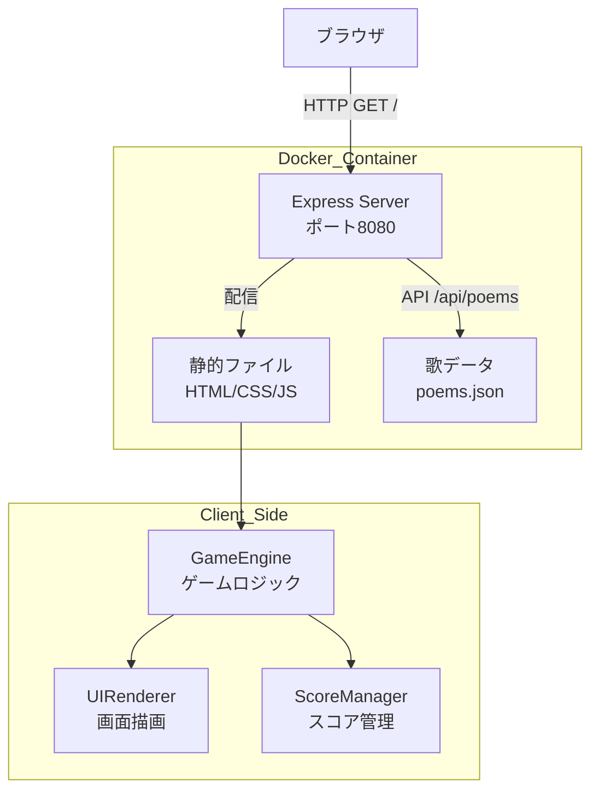
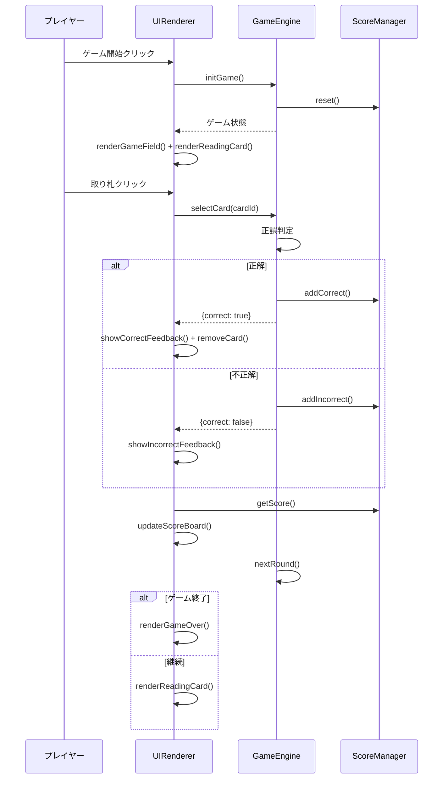

# 設計書: 百人一首ゲーム

## 概要

百人一首ゲームは、Docker上で動作するブラウザベースのWebアプリケーションである。フロントエンドはHTML/CSS/JavaScriptで構成し、バックエンドにはNode.js（Express）を使用する。百人一首の100首の歌データをJSON形式で管理し、読み札の提示・取り札の選択・スコア管理をクライアントサイドで処理する。

技術スタック:
- フロントエンド: HTML5, CSS3, Vanilla JavaScript（フレームワーク不使用で軽量化）
- バックエンド: Node.js + Express（静的ファイル配信）
- データ: JSON形式の歌データファイル
- 実行環境: Docker + docker-compose

## アーキテクチャ



アーキテクチャの方針:
- サーバーは静的ファイル配信と歌データAPIのみを担当する
- ゲームロジックはすべてクライアントサイドで実行する（サーバー負荷を最小化）
- 歌データはサーバー起動時にJSONファイルから読み込み、APIで提供する

## コンポーネントとインターフェース

### 1. Express Server（サーバーサイド）

```javascript
// server.js
const express = require('express');
const app = express();

// 静的ファイル配信
app.use(express.static('public'));

// 歌データAPI
app.get('/api/poems', (req, res) => {
  res.json(poems);
});

app.listen(8080);
```

責務:
- 静的ファイル（HTML/CSS/JS）の配信
- 歌データのJSON API提供
- ポート8080でのHTTPリクエスト受付

### 2. GameEngine（クライアントサイド）

```javascript
// gameEngine.js
class GameEngine {
  constructor(poems) { ... }
  
  // ゲーム初期化: 歌をシャッフルし場に配置
  initGame() { ... }
  
  // 現在の読み札を取得
  getCurrentReadingCard() { ... }
  
  // 取り札の選択を判定
  selectCard(cardId) { ... }
  
  // 次のラウンドに進む
  nextRound() { ... }
  
  // ゲーム終了判定
  isGameOver() { ... }
  
  // ゲーム状態を取得
  getGameState() { ... }
}
```

責務:
- ゲームの初期化とシャッフル
- 読み札の順序管理
- 取り札選択の正誤判定
- ゲーム進行の制御

### 3. ScoreManager（クライアントサイド）

```javascript
// scoreManager.js
class ScoreManager {
  constructor(totalCards) { ... }
  
  // 正解時にスコア加算
  addCorrect() { ... }
  
  // 不正解を記録
  addIncorrect() { ... }
  
  // 現在のスコア情報を取得
  getScore() { ... }
  
  // 正答率を計算
  getAccuracy() { ... }
  
  // スコアをリセット
  reset() { ... }
}
```

責務:
- スコアの加算・管理
- 正答率の計算
- 残り札数の追跡

### 4. UIRenderer（クライアントサイド）

```javascript
// uiRenderer.js
class UIRenderer {
  constructor(gameEngine, scoreManager) { ... }
  
  // ゲーム画面を描画
  renderGameField(cards) { ... }
  
  // 読み札を表示
  renderReadingCard(poem) { ... }
  
  // スコアボードを更新
  updateScoreBoard(score) { ... }
  
  // 正解フィードバック（緑ハイライト）
  showCorrectFeedback(cardElement) { ... }
  
  // 不正解フィードバック（赤ハイライト）
  showIncorrectFeedback(cardElement) { ... }
  
  // ゲーム終了画面を表示
  renderGameOver(finalScore) { ... }
  
  // カードを場から除去（アニメーション付き）
  removeCard(cardElement) { ... }
}
```

責務:
- 取り札のグリッド表示（縦書き）
- 読み札（上の句・作者名）の表示
- 正誤フィードバックのアニメーション
- スコアボードのリアルタイム更新
- ゲーム終了画面の表示

### コンポーネント間の連携



## データモデル

### Poem（歌データ）

```javascript
/**
 * 百人一首の一首を表すデータ構造
 * @typedef {Object} Poem
 * @property {number} id - 歌番号（1〜100）
 * @property {string} author - 作者名
 * @property {string} upperVerse - 上の句（五・七・五）
 * @property {string} lowerVerse - 下の句（七・七）
 */

// 例:
{
  "id": 1,
  "author": "天智天皇",
  "upperVerse": "秋の田の かりほの庵の 苫をあらみ",
  "lowerVerse": "わが衣手は 露にぬれつつ"
}
```

### GameState（ゲーム状態）

```javascript
/**
 * ゲームの現在の状態を表すデータ構造
 * @typedef {Object} GameState
 * @property {Poem[]} remainingCards - 場に残っている取り札の配列
 * @property {Poem} currentPoem - 現在の読み札の歌
 * @property {number} currentRound - 現在のラウンド番号
 * @property {number} totalRounds - 総ラウンド数
 * @property {boolean} isGameOver - ゲーム終了フラグ
 */
```

### ScoreData（スコアデータ）

```javascript
/**
 * スコア情報を表すデータ構造
 * @typedef {Object} ScoreData
 * @property {number} correct - 正解数
 * @property {number} incorrect - 不正解数
 * @property {number} remaining - 残り札数
 * @property {number} accuracy - 正答率（0〜100のパーセンテージ）
 */
```

### poems.json（歌データファイル）

```json
[
  {
    "id": 1,
    "author": "天智天皇",
    "upperVerse": "秋の田の かりほの庵の 苫をあらみ",
    "lowerVerse": "わが衣手は 露にぬれつつ"
  },
  ...
]
```

歌データは100首すべてをJSON配列として保持する。サーバー起動時に読み込み、`/api/poems` エンドポイントで配信する。


## 正当性プロパティ（Correctness Properties）

*プロパティとは、システムのすべての有効な実行において真であるべき特性や振る舞いのことである。プロパティは、人間が読める仕様と機械的に検証可能な正当性保証の橋渡しとなる。*

### Property 1: 歌データ構造の検証

*For any* Poemオブジェクト、バリデーション関数は id（1〜100の整数）、author（非空文字列）、upperVerse（非空文字列）、lowerVerse（非空文字列）の4フィールドがすべて存在し有効な場合のみ受け入れ、いずれかが欠落または無効な場合は拒否する

**Validates: Requirements 1.2**

### Property 2: 歌データのシリアライズ往復

*For any* 有効なPoemオブジェクト、JSON.stringify でシリアライズした後 JSON.parse でデシリアライズすると、元のオブジェクトと同一の値を持つオブジェクトが復元される

**Validates: Requirements 1.3**

### Property 3: シャッフルは有効な順列を生成する

*For any* 歌データの配列、シャッフル後の配列は元の配列と同じ要素を同じ数だけ含み、重複や欠落がない（順列である）

**Validates: Requirements 2.1, 2.2**

### Property 4: 読み札は有効な歌データを提供する

*For any* ゲーム状態において、getCurrentReadingCard が返す歌データは upperVerse と author を含む有効な Poem オブジェクトである

**Validates: Requirements 3.1**

### Property 5: ラウンド進行は次の歌に進む

*For any* ゲーム進行中の状態において、nextRound を呼び出すと currentRound が1増加し、currentPoem が前のラウンドとは異なる歌に変わる

**Validates: Requirements 3.3**

### Property 6: 取り札選択の正誤判定とスコア更新

*For any* ゲーム状態と選択されたカードにおいて、正しいカードを選択した場合はスコアが1増加し残りカード数が1減少する。誤ったカードを選択した場合はスコアと残りカード数が変化しない

**Validates: Requirements 4.1, 4.2**

### Property 7: 正答率の計算整合性

*For any* 正解数 c と不正解数 i の組み合わせ（c + i > 0）において、正答率は c / (c + i) * 100 と等しく、0〜100の範囲内である

**Validates: Requirements 5.1**

## エラーハンドリング

| エラー状況 | 対応 |
|---|---|
| 歌データの読み込み失敗 | エラーメッセージを表示し、リトライボタンを提供する |
| 不正な歌データ形式 | バリデーションエラーをコンソールに出力し、不正なデータをスキップする |
| API通信エラー | 「データの読み込みに失敗しました」メッセージを表示する |
| ゲーム状態の不整合 | ゲームをリセットし、初期画面に戻す |

## テスト戦略

### テストフレームワーク

- ユニットテスト: Jest
- プロパティベーステスト: fast-check（JavaScript用プロパティベーステストライブラリ）

### ユニットテスト

具体的な例とエッジケースを検証する:
- 歌データが100首すべて含まれていることの確認（要件 1.1）
- ゲーム初期化時のスコアが0であること（要件 2.3）
- すべてのカードが除去された場合にゲーム終了となること（要件 5.2）
- 空の歌データでの初期化エラーハンドリング

### プロパティベーステスト

各プロパティテストは最低100回のイテレーションで実行する。各テストには設計書のプロパティ番号をタグとして付与する。

タグ形式: **Feature: hyakunin-isshu-game, Property {番号}: {プロパティ名}**

| プロパティ | テスト内容 | 対応要件 |
|---|---|---|
| Property 1 | ランダムなPoemオブジェクトのバリデーション | 1.2 |
| Property 2 | ランダムなPoemのJSON往復テスト | 1.3 |
| Property 3 | ランダムな配列のシャッフル順列検証 | 2.1, 2.2 |
| Property 4 | ランダムなゲーム状態での読み札データ検証 | 3.1 |
| Property 5 | ランダムなゲーム状態でのラウンド進行検証 | 3.3 |
| Property 6 | ランダムなゲーム状態での取り札選択判定検証 | 4.1, 4.2 |
| Property 7 | ランダムな正解・不正解数での正答率計算検証 | 5.1 |

### テスト構成

```
tests/
├── unit/
│   ├── poemData.test.js       # 歌データの完全性テスト
│   ├── gameEngine.test.js     # ゲームエンジンのユニットテスト
│   └── scoreManager.test.js   # スコア管理のユニットテスト
└── property/
    ├── poemValidation.prop.js # Property 1: 歌データ検証
    ├── poemRoundTrip.prop.js  # Property 2: シリアライズ往復
    ├── shuffle.prop.js        # Property 3: シャッフル順列
    ├── readingCard.prop.js    # Property 4: 読み札データ
    ├── roundProgress.prop.js  # Property 5: ラウンド進行
    ├── cardSelection.prop.js  # Property 6: 取り札選択判定
    └── accuracy.prop.js       # Property 7: 正答率計算
```
